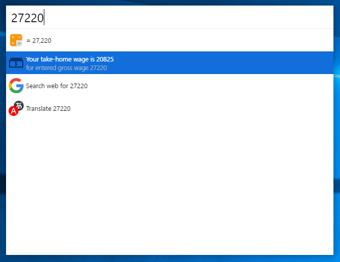

# cerebro-salary 

> [Cerebro](http://www.cerebroapp.com) plugin to calculate take-home wage.

## Usage

In Cerebro, type your gross wage to get take-home wage calculation.

## Related

- [Cerebro](http://github.com/KELiON/cerebro) – main repo for Cerebro app;

## License

MIT © [Premysl Krajcovic](mailto:premyslkrajcovic@gmail.com)